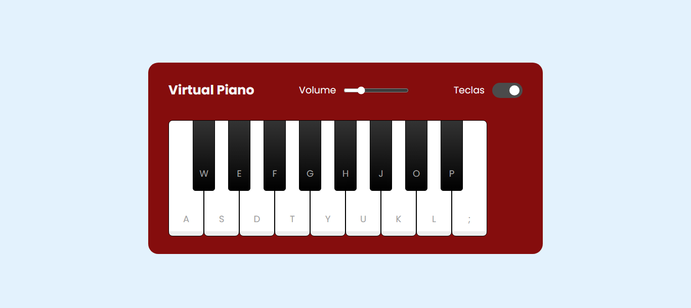

 # 🎹 Piano Interativo - Projeto com HTML, CSS e JavaScript

Este projeto é uma implementação de um piano interativo utilizando HTML, CSS e JavaScript. Ele permite que o usuário toque as notas do piano tanto clicando nas teclas com o mouse quanto pressionando as teclas correspondentes do teclado. Além disso, o projeto inclui funcionalidades de controle de volume e a opção de ocultar/mostrar as teclas do piano.

## 🛠️ Funcionalidades

- **Teclas Interativas**: O piano possui teclas que podem ser tocadas ao clicar com o mouse ou pressionando as teclas correspondentes no teclado.
- **Controle de Volume**: O usuário pode ajustar o volume do som utilizando um controle deslizante (slider).
- **Ocultar/Mostrar Teclas**: O usuário pode ocultar ou mostrar as teclas do piano com a opção de checkbox.
- **Feedback Visual**: Ao pressionar uma tecla, ela ganha uma animação de "ativação" para indicar que foi clicada ou pressionada.

## Imagem do Piano

## Como Funciona

### 1. Interação com o Piano

O piano possui várias teclas representadas por elementos de `
`. Cada tecla está associada a uma nota musical (representada por um arquivo `.wav`). O usuário pode:

- **Clicar nas teclas**: Ao clicar nas teclas do piano, o som correspondente é reproduzido.
- **Usar o Teclado do Computador**: As teclas do piano também são mapeadas para as teclas do teclado (por exemplo, as teclas "a", "s", "d", etc.).

### 2. Controle de Volume

O volume do áudio pode ser ajustado utilizando um controle deslizante. O valor do controle de volume afeta diretamente o volume do áudio reproduzido.

### 3. Ocultar/Mostrar Teclas

Há uma opção de checkbox que permite ao usuário ocultar ou mostrar as teclas do piano.

## Como Rodar o Projeto

1. Clone ou faça o download do repositório.
2. Abra o arquivo `index.html` no seu navegador.
3. Utilize as teclas do teclado ou clique nas teclas do piano para começar a tocar.
4. Ajuste o volume e experimente ocultar ou mostrar as teclas do piano com o checkbox.

## 💻 Tecnologias Utilizadas

- **HTML**: Para a estrutura do piano e os controles.
- **CSS**: Para estilização do piano e animações das teclas.
- **JavaScript**: Para a lógica de interação, controle de volume e funcionalidades adicionais.

  

  
  
  
  
  

###

